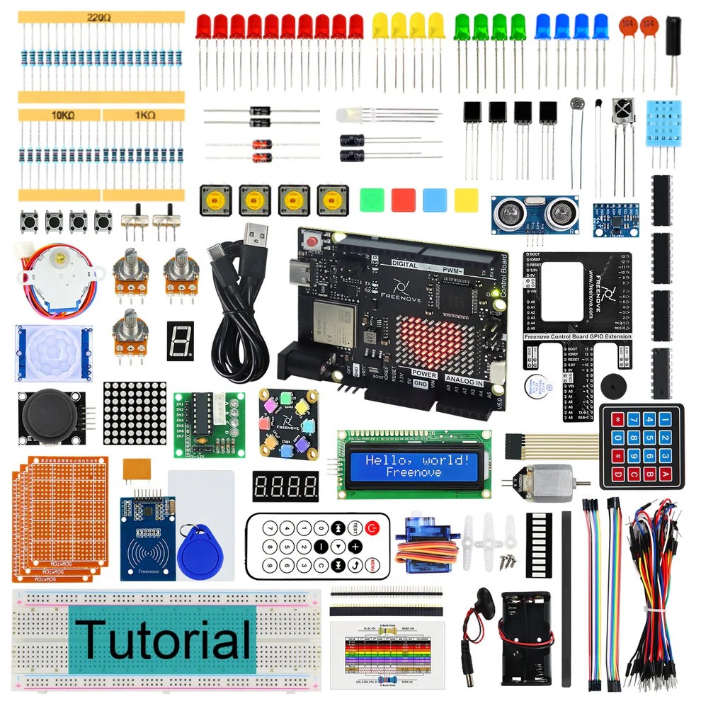
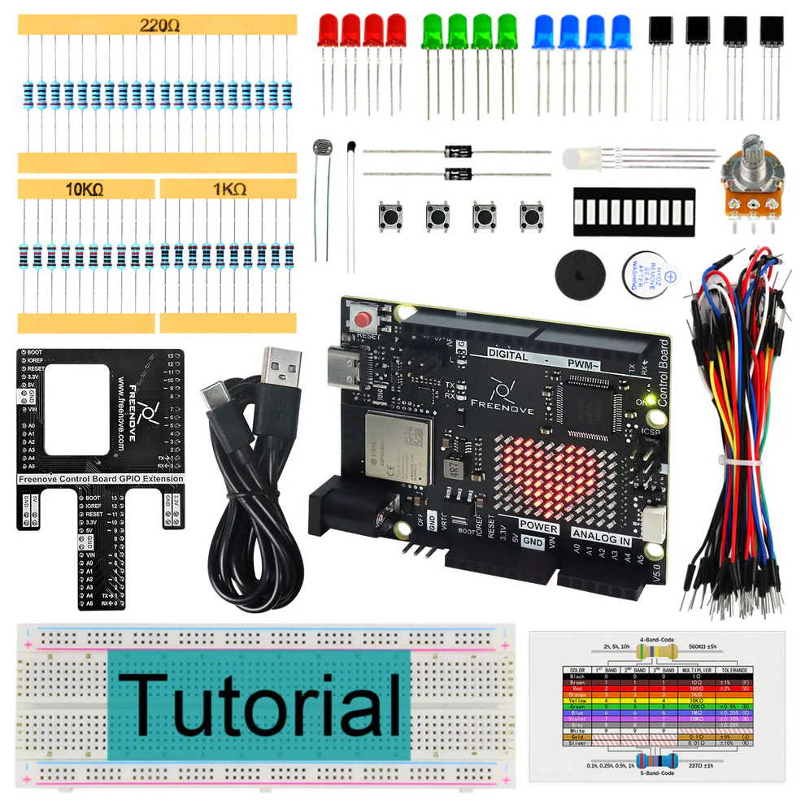
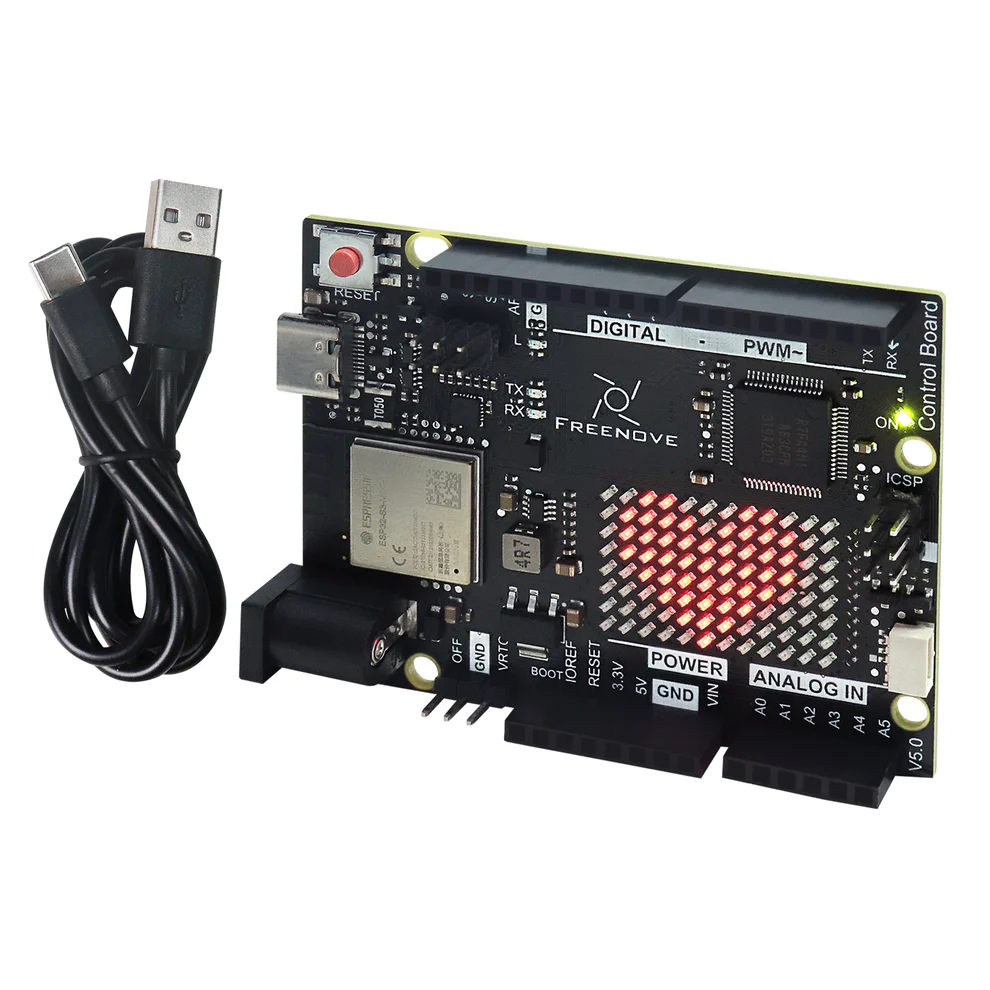

Starter kits
----------------------------------------------------------------

.. list-table:: 
   :header-rows: 1 
   :width: 70%
   :align: center
   :widths: 6 3 12
   
   * -  Image
     -  SKU
     -  Name

   * -  .. centered:: |FNK0092|
     -  .. centered:: :Freenove:`fnk0092 <fnk0092>`
     -  **Freenove Complete Starter Kit with Board V5 WiFi Mini**
      
        **(Compatible with Arduino IDE)**

   * -  .. centered:: |FNK0093|
     -  .. centered:: :Freenove:`fnk0093 <fnk0093>`
     -  **Freenove Ultimate Starter Kit with Board V5 WiFi Mini**

        **(Compatible with Arduino IDE)**

   * -  .. centered:: |FNK0094|
     -  .. centered:: :Freenove:`fnk0094 <fnk0094>`
     -  **Freenove Super Starter Kit with Board V5 WiFi Mini**

        **(Compatible with Arduino IDE)**

   * -  .. centered:: |FNK0095|
     -  .. centered:: :Freenove:`fnk0095 <fnk0095>`
     -  **Freenove Basic Starter Kit with Board V5 WiFi Mini**

        **(Compatible with Arduino IDE)**

   * -  .. centered:: |FNK0096|
     -  .. centered:: :Freenove:`fnk0096 <fnk0096>`
     -  **Freenove Control Board V5 Compatible with**
      
        **Arduino UNO R4 WiFi Mini**

.. |FNK0092| image:: ../_static/products/Arduino/FNK0092.png    

.. |FNK0094| image:: ../_static/products/Arduino/FNK0094.png    

