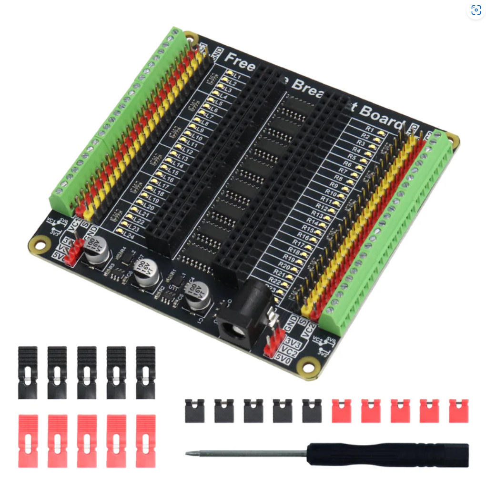

.. list-table:: 
   :header-rows: 1 
   :width: 70%
   :align: center
   :widths: 6 3 12
   
   * -  Image
     -  SKU
     -  Name

   * -  .. centered:: |FNK0079|
     -  .. centered:: :Freenove:`fnk0079 <fnk0079>`
     -  **Freenove Breakout Board for Arduino Nano**
      
        **Micro Raspberry Pi Pico 1 2 W ESP32 ESP8266**
       

   * -  .. centered:: |FNK0101|
     -  .. centered:: :Freenove:`fnk0101 <fnk0101>`
     -  **Freenove I2C IIC LCD 1602 2004 Module**

.. |FNK0079| image:: ../_static/products/Components/FNK0079.png
