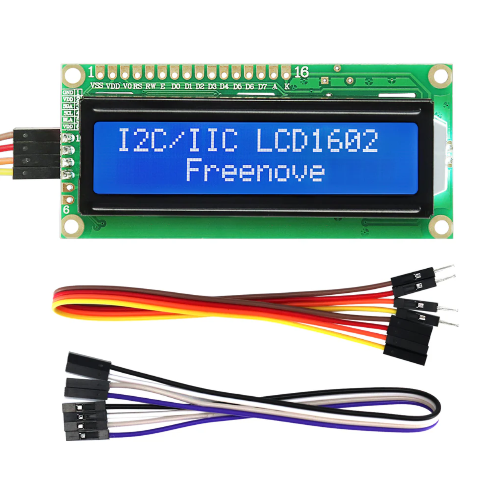
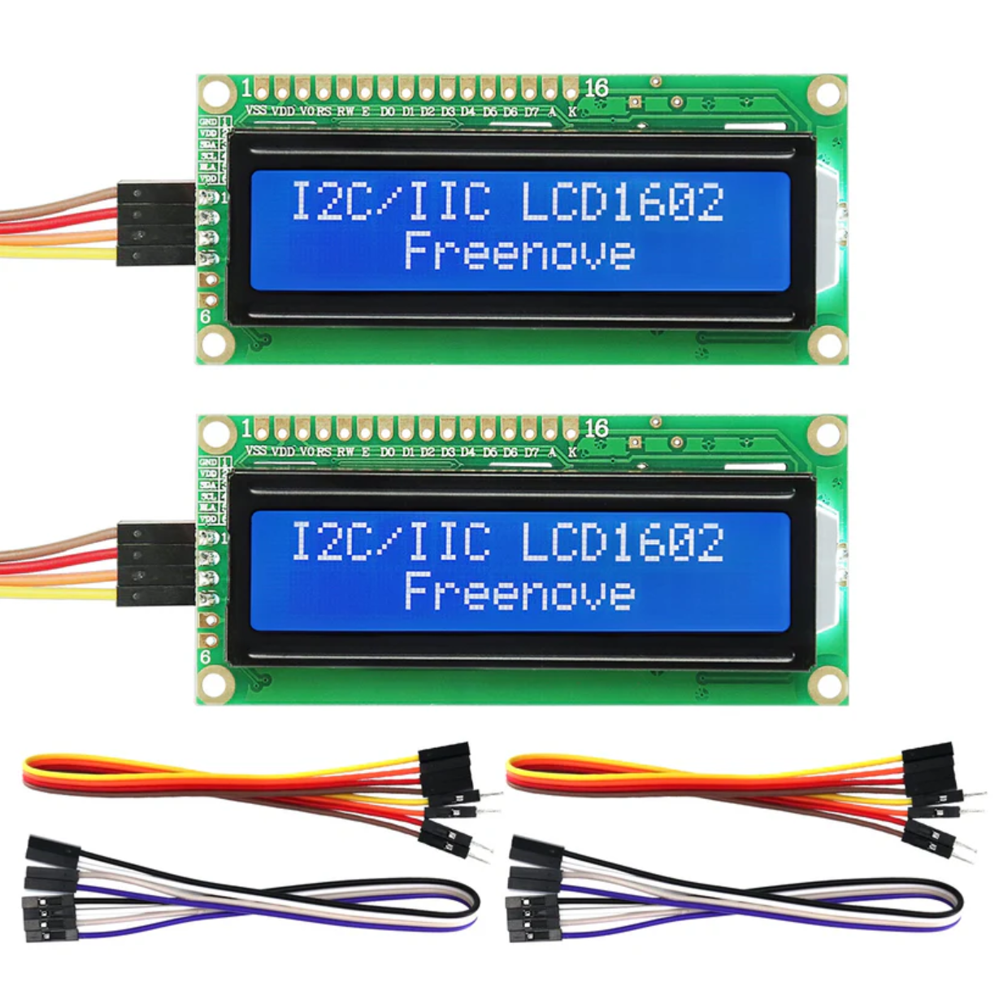
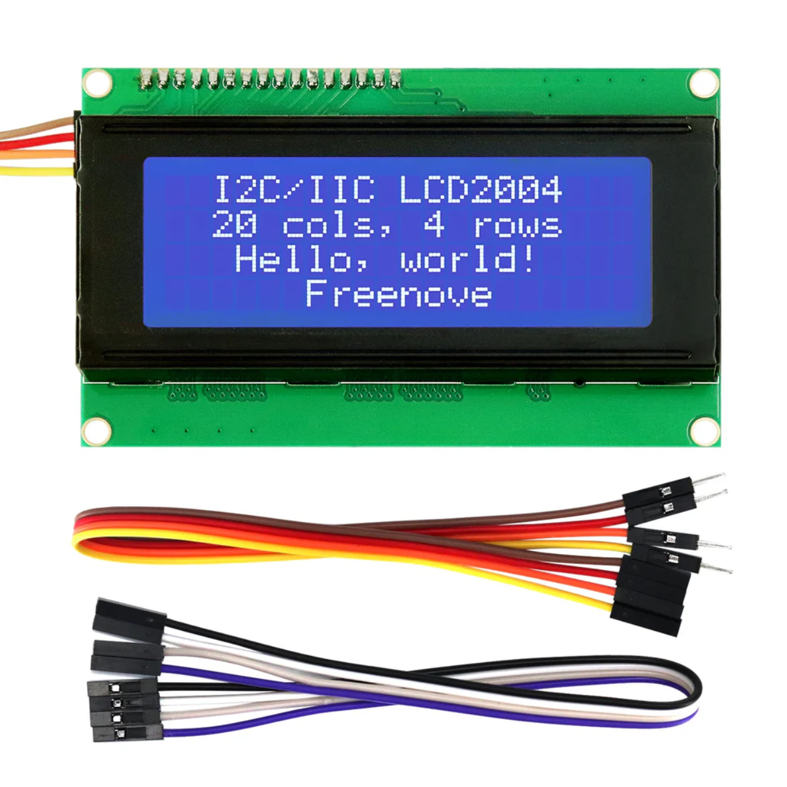
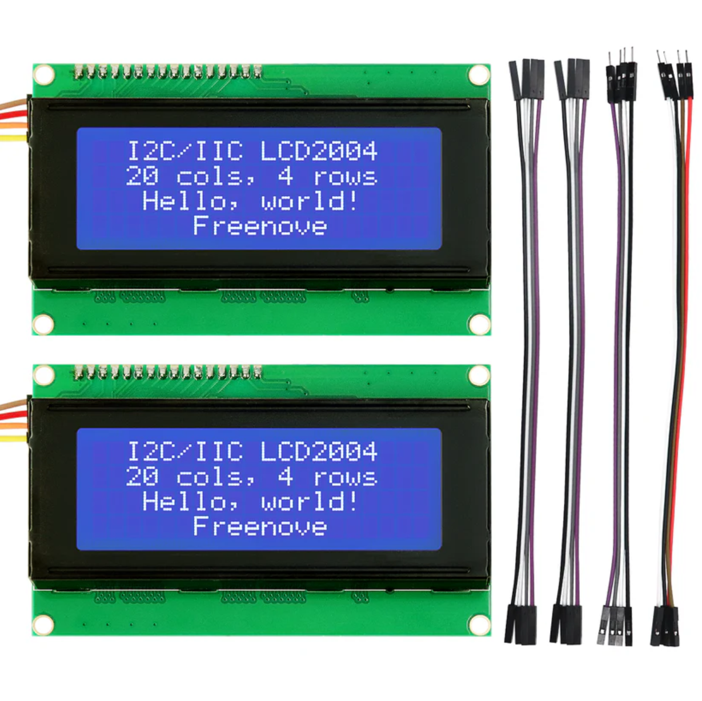

.. list-table:: 
   :header-rows: 1 
   :width: 85%
   :align: center
   :widths: 6 3 12
   :class: product-table
   
   * -  Image
     -  SKU
     -  Name

   * -  .. centered:: |FNK0079A|
     -  .. centered:: :Freenove:`FNK0079A <fnk0079>`
     -  **Freenove Breakout Board for Arduino Nano**
      
        **Freenove I2C LCD 1602 Module [Integrated]**

   * -  .. centered:: |FNK0079B|
     -  .. centered:: :Freenove:`FNK0079B <fnk0079>`
     -  **Freenove Breakout Board for Arduino Nano**
      
        **Freenove I2C LCD 1602 Module [Integrated] (2 Pack)**

   * -  .. centered:: |FNK0079C|
     -  .. centered:: :Freenove:`FNK0079C <fnk0079>`
     -  **Freenove Breakout Board for Arduino Nano**
      
        **Freenove I2C LCD 2004 Module**

   * -  .. centered:: |FNK0079D|
     -  .. centered:: :Freenove:`FNK0079D <fnk0079>`
     -  **Freenove Breakout Board for Arduino Nano**
      
        **Freenove I2C LCD 2004 Module (2 Pack)**

   * -  .. centered:: |FNK0101|
     -  .. centered:: :Freenove:`fnk0101 <fnk0101>`
     -  **Freenove Breakout Board**

.. |FNK0101| image:: ../_static/products/Components/FNK0101.png