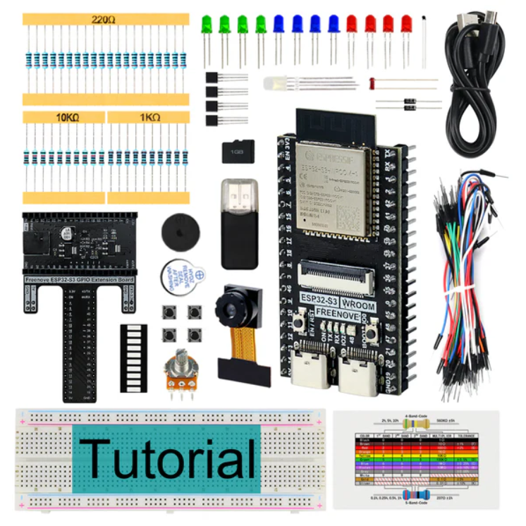
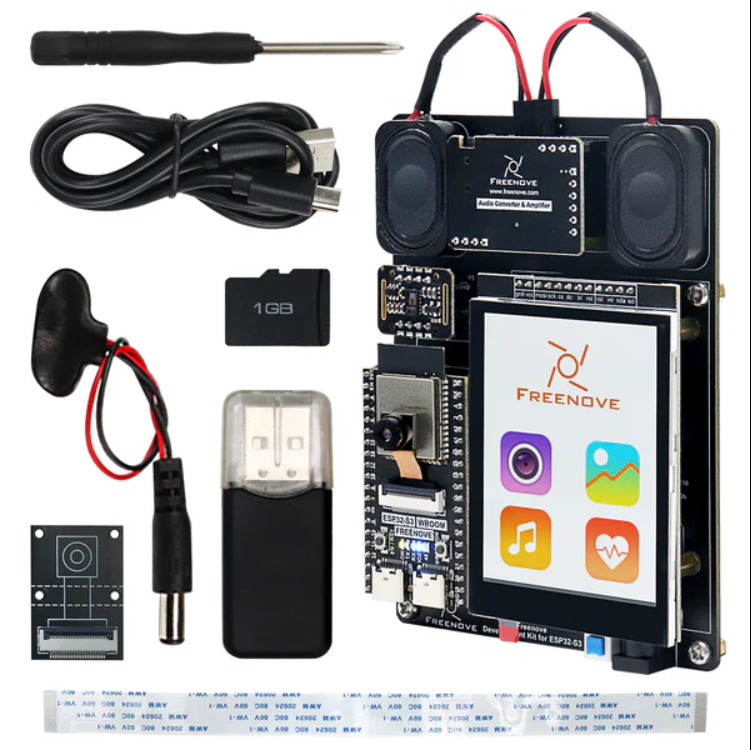

Starter kits
----------------------------------------------------------------

.. list-table:: 
   :header-rows: 1 
   :width: 85%
   :align: center
   :widths: 6 3 12
   :class: product-table
   
   * -  Image
     -  SKU
     -  Name

   * -  .. centered:: |FNK0082|
     -  .. centered:: :Freenove:`fnk0082 <fnk0082>`
     -  **Freenove Ultimate Starter Kit for ESP32-S3**

   * -  .. centered:: |FNK0083|
     -  .. centered:: :Freenove:`fnk0083 <fnk0083>`
     -  **Freenove Super Starter Kit for ESP32-S3**

   * -  .. centered:: |FNK0084|
     -  .. centered:: :Freenove:`fnk0084 <fnk0084>`
     -  **Freenove Basic Starter Kit for ESP32-S3**

   * -  .. centered:: |FNK0086|
     -  .. centered:: :Freenove:`fnk0086 <fnk0086>`
     -  **Freenove Development Kit for ESP32-S3**

   * -  .. centered:: |FNK0102A|
     -  .. centered:: :Freenove:`fnk0102 <fnk0102>`
     -  **Freenove Media Kit for ESP32-S3**

.. |FNK0082| image:: ../_static/products/ESP32S3/FNK0082.png   
    :class: product-image
.. |FNK0083| image:: ../_static/products/ESP32S3/FNK0083.png   
    :class: product-image

Boards
----------------------------------------------------------------

.. list-table:: 
   :header-rows: 1 
   :width: 85%
   :align: center
   :widths: 6 3 12
   :class: product-table
   
   * -  Image
     -  SKU
     -  Name

   * -  .. centered:: |FNK0085B|
     -  .. centered:: :Freenove:`FNK0085 <fnk0085>`
     -  **Freenove ESP32-S3-WROOM Board**

   * -  .. centered:: |FNK0099A|
     -  .. centered:: :Freenove:`FNK0099 <fnk0099>`
     -  **Freenove ESP32-S3-WROOM Board Lite**
 
.. |FNK0085B| image:: ../_static/products/ESP32S3/FNK0085B.png 
    :class: product-image
.. |FNK0099A| image:: ../_static/products/ESP32S3/FNK0099A.png 
    :class: product-image