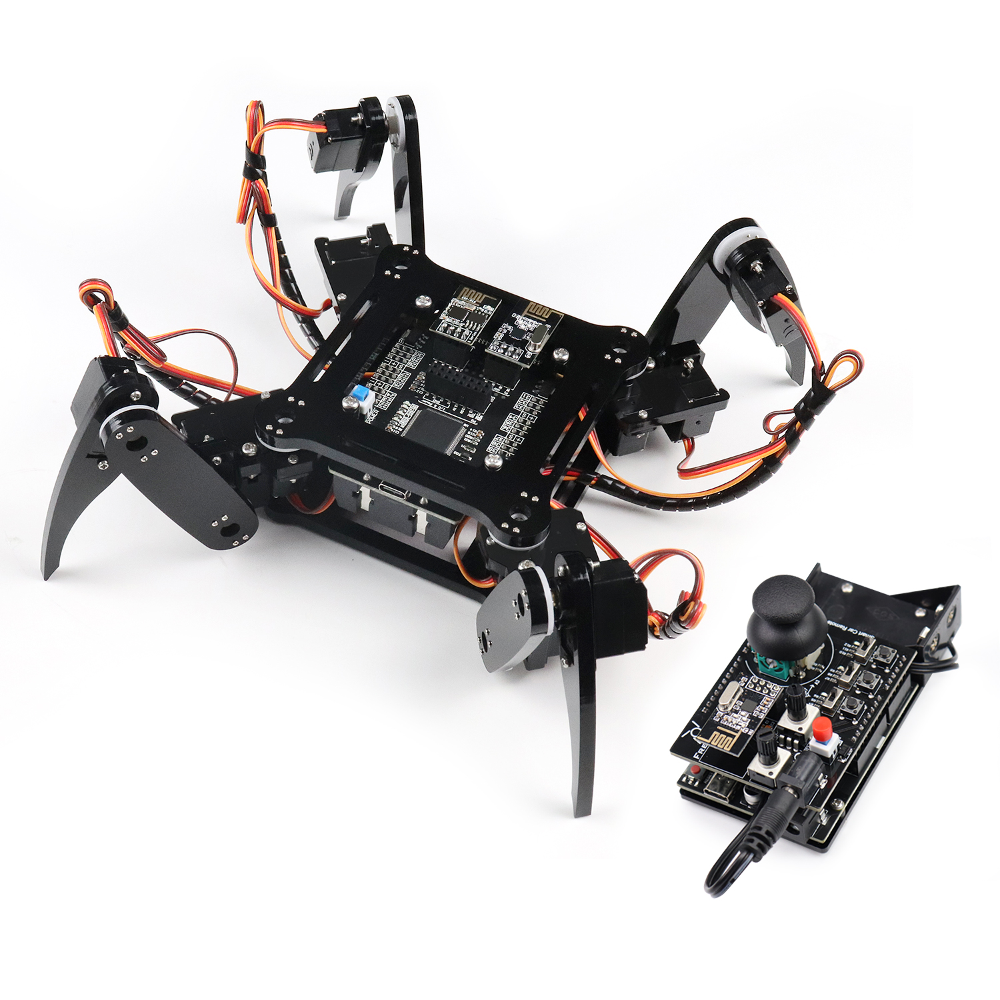

Starter kits
----------------------------------------------------------------

.. list-table:: 
   :header-rows: 1 
   :width: 70%
   :align: center
   :widths: 6 3 12
   
   * -  Image
     -  SKU
     -  Name

   * -  .. centered:: |FNK0017.MAIN|
     -  .. centered:: :Freenove:`fnk0017 <fnk0017>`
     -  **Freenove Ultimate Starter Kit (Compatible with Arduino IDE)**

   * -  .. centered:: |FNK0034.MAIN|
     -  .. centered:: :Freenove:`fnk0034 <fnk0034>`
     -  **Freenove RFID Starter Kit V2.0 (Compatible with Arduino IDE)**

   * -  .. centered:: |FNK0067|
     -  .. centered:: `fnk0067 <https://docs.freenove.com/projects/fnk0017/en/latest/fnk0017/codes/tutorial/Note.html>`__
     -  **Freenove Control Board (Compatible with Arduino IDE)**

   * -  .. centered:: |FNK0059.MAIN|
     -  .. centered:: :Freenove:`fnk0059 <fnk0059>`
     -  **Freenove Projects Kit (Compatible with Arduino IDE)**

.. |FNK0017.MAIN| image:: ../_static/products/Arduino/FNK0017E.MAIN.jpg    
.. |FNK0034.MAIN| image:: ../_static/products/Arduino/FNK0034E.MAIN.jpg    
.. |FNK0059.MAIN| image:: ../_static/products/Arduino/FNK0059A.MAIN.jpg    
.. |FNK0067| image:: ../_static/products/Arduino/FNK0067.png   

Robotics kits
----------------------------------------------------------------

.. list-table:: 
   :header-rows: 1 
   :width: 70%
   :align: center
   :widths: 6 3 12
   
   * -  Image
     -  SKU
     -  Name

   * -  .. centered:: |FNK0030.MAIN|
     -  .. centered:: :Freenove:`fnk0030 <fnk0030>`
     -  **Freenove Quadruped Robot Kit with Remote** 
      
        **(Compatible with Arduino IDE)**

   * -  .. centered:: |FNK0031.MAIN|
     -  .. centered:: :Freenove:`fnk0031 <fnk0031>`
     -  **Freenove Hexapod Robot Kit with Remote** 
      
        **(Compatible with Arduino IDE)**

   * -  .. centered:: |FNK0041.MAIN|
     -  .. centered:: :Freenove:`fnk0041 <fnk0041>`
     -  **Freenove 4WD Car Kit** 
      
        **(Compatible with Arduino IDE)**

   * -  .. centered:: |FNK0042.MAIN|
     -  .. centered:: :Freenove:`fnk0042 <fnk0042>`
     -  **Freenove Robot Ant Kit** 
      
        **(Compatible with Arduino IDE)**

.. |FNK0031.MAIN| image:: ../_static/products/Arduino/FNK0031.MAIN.jpg
.. |FNK0041.MAIN| image:: ../_static/products/Arduino/FNK0041B.MAIN.jpg    
.. |FNK0042.MAIN| image:: ../_static/products/Arduino/FNK0042.MAIN.jpg