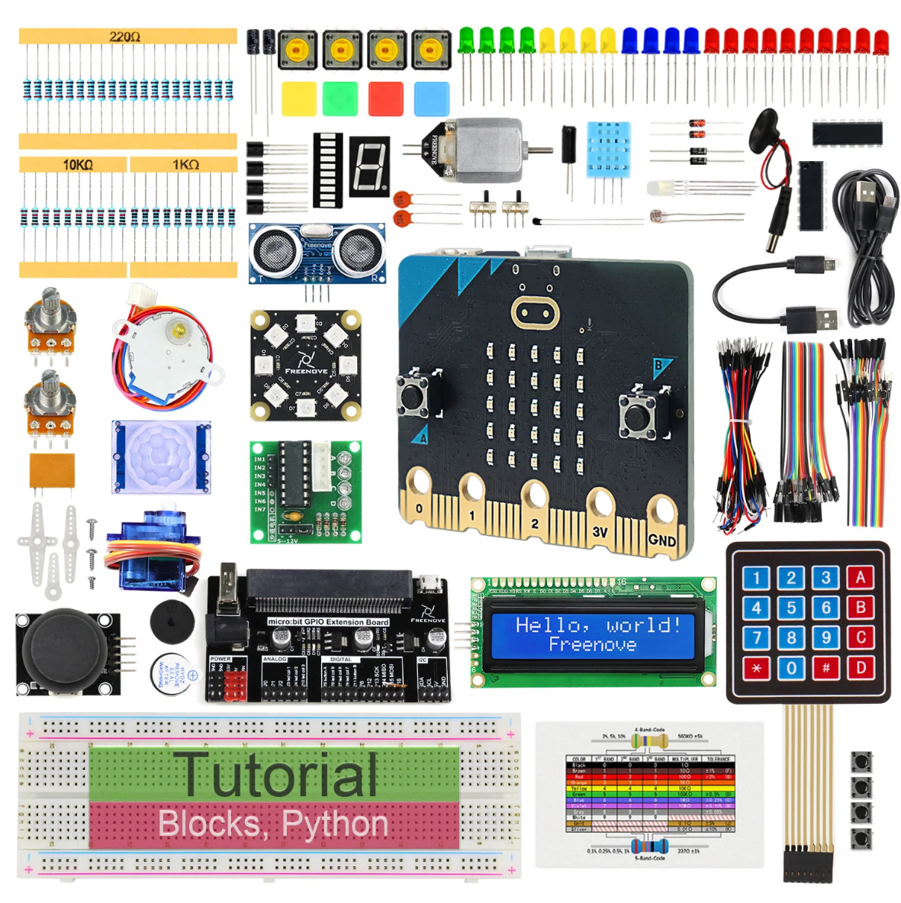
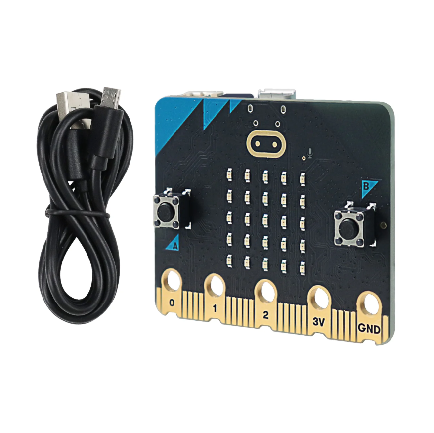
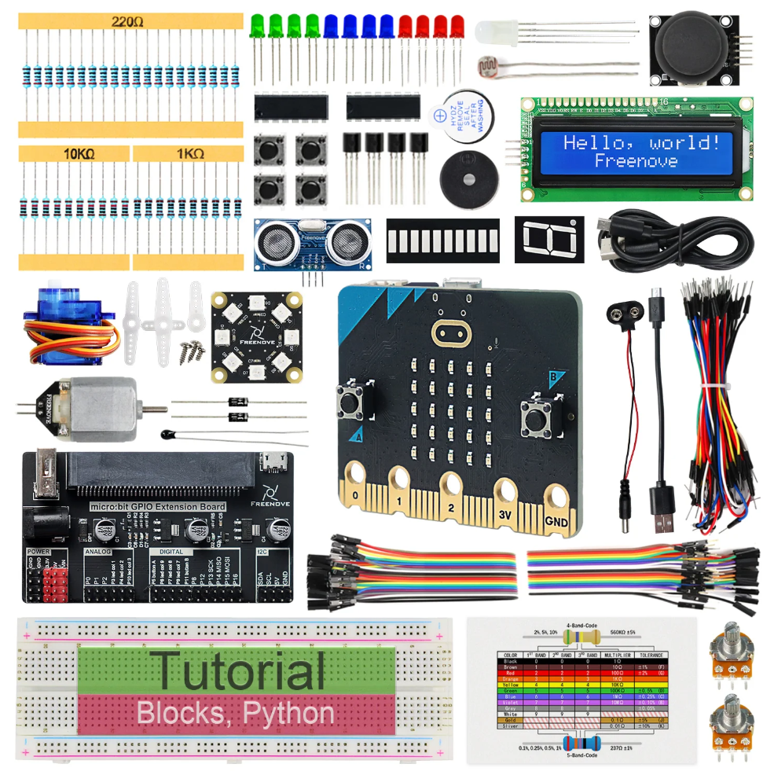
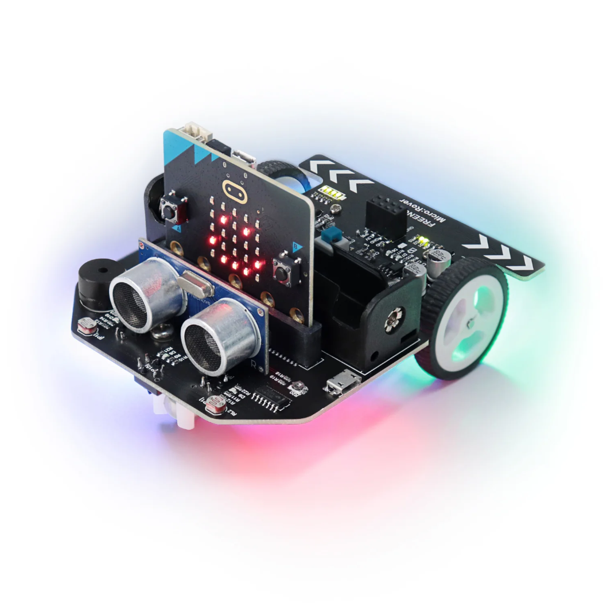

Starter kits
----------------------------------------------------------------

.. list-table:: 
   :header-rows: 1 
   :width: 70%
   :align: center
   :widths: 6 3 12
   
   * -  Image
     -  SKU
     -  Name

   * -  .. centered:: |FNK0045|
     -  .. centered:: :Freenove:`fnk0045 <fnk0045>`
     -  **Freenove Ultimate Starter Kit for BBC micro:bit V2**

   * -  .. centered:: |FNK0070|
     -  .. centered:: :Freenove:`fnk0070 <fnk0070>`
     -  **Freenove BBC micro:bit V2 Board**

   * -  .. centered:: |FNK0071|
     -  .. centered:: :Freenove:`fnk0071 <fnk0071>`
     -  **Freenove Super Starter Kit for BBC micro:bit V2**

   * -  .. centered:: |FNK0072|
     -  .. centered:: :Freenove:`fnk0072 <fnk0072>`
     -  **Freenove Basic Starter Kit for BBC micro:bit V2**

.. |FNK0072| image:: ../_static/products/micro_bit/FNK0072.png    

Robotics kits
----------------------------------------------------------------

.. list-table:: 
   :header-rows: 1 
   :width: 70%
   :align: center
   :widths: 6 3 12
   
   * -  Image
     -  SKU
     -  Name

   * -  .. centered:: |FNK0037|
     -  .. centered:: :Freenove:`fnk0037 <fnk0037>`
     -  **Freenove Micro:Rover Kit for BBC micro:bit V2**

