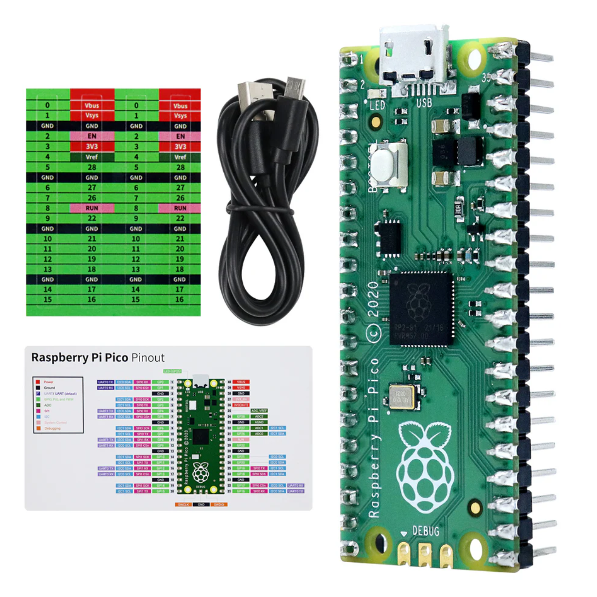

Starter kits
----------------------------------------------------------------

.. list-table:: 
   :header-rows: 1 
   :width: 85%
   :align: center
   :widths: 6 3 12
   :class: product-table
   
   * -  Image
     -  SKU
     -  Name

   * -  .. centered:: |FNK0058A|
     -  .. centered:: :Freenove:`FNK0058A <fnk0058>`
     -  **Freenove Ultimate Starter Kit for Raspberry Pi Pico (Included)**

   * -  .. centered:: |FNK0058B|
     -  .. centered:: :Freenove:`FNK0058B <fnk0058>`
     -  **Freenove Ultimate Starter Kit for Raspberry Pi Pico (Not Included)**

   * -  .. centered:: |FNK0058C|
     -  .. centered:: :Freenove:`FNK0058C <fnk0058>`
     -  **Freenove Ultimate Starter Kit for Raspberry Pi Pico W (Included)**

   * -  .. centered:: |FNK0058D|
     -  .. centered:: :Freenove:`FNK0058D <fnk0058>`
     -  **Freenove Ultimate Starter Kit for Raspberry Pi Pico 2 (Included)**

   * -  .. centered:: |FNK0058E|
     -  .. centered:: :Freenove:`FNK0058E <fnk0058>`
     -  **Freenove Ultimate Starter Kit for Raspberry Pi Pico 2 W (Included)**

   * -  .. centered:: |FNK0063A|
     -  .. centered:: :Freenove:`FNK0063A <fnk0063>`
     -  **Freenove Super Starter Kit for Raspberry Pi Pico (Included)**

   * -  .. centered:: |FNK0063B|
     -  .. centered:: :Freenove:`FNK0063B <fnk0063>`
     -  **Freenove Super Starter Kit for Raspberry Pi Pico (Not Included)**

   * -  .. centered:: |FNK0063C|
     -  .. centered:: :Freenove:`FNK0063C <fnk0063>`
     -  **Freenove Super Starter Kit for Raspberry Pi Pico W (Included)**

   * -  .. centered:: |FNK0063D|
     -  .. centered:: :Freenove:`FNK0063D <fnk0063>`
     -  **Freenove Super Starter Kit for Raspberry Pi Pico 2 (Included)**

   * -  .. centered:: |FNK0063E|
     -  .. centered:: :Freenove:`FNK0063E <fnk0063>`
     -  **Freenove Super Starter Kit for Raspberry Pi Pico 2 W (Included)**

   * -  .. centered:: |FNK0064A|
     -  .. centered:: :Freenove:`FNK0064A <fnk0064>`
     -  **Freenove Basic Starter Kit for Raspberry Pi Pico W (Included)**

   * -  .. centered:: |FNK0064C|
     -  .. centered:: :Freenove:`FNK0064C <fnk0064>`
     -  **Freenove Basic Starter Kit for Raspberry Pi Pico W (Included)**

   * -  .. centered:: |FNK0064D|
     -  .. centered:: :Freenove:`FNK0064D <fnk0064>`
     -  **Freenove Basic Starter Kit for Raspberry Pi Pico 2 (Included)**

   * -  .. centered:: |FNK0064E|
     -  .. centered:: :Freenove:`FNK0064E <fnk0064>`
     -  **Freenove Basic Starter Kit for Raspberry Pi Pico 2 W (Included)**

.. |FNK0058E| image:: ../_static/products/RaspberryPi-Pico/FNK0058E.png  

.. |FNK0063E| image:: ../_static/products/RaspberryPi-Pico/FNK0063E.png  

.. |FNK0064E| image:: ../_static/products/RaspberryPi-Pico/FNK0064E.png  

Robotics kits
----------------------------------------------------------------

.. list-table:: 
   :header-rows: 1 
   :width: 85%
   :align: center
   :widths: 6 3 12
   :class: product-table
   
   * -  Image
     -  SKU
     -  Name

   * -  .. centered:: |FNK0033A|
     -  .. centered:: :Freenove:`FNK0033A <fnk0033>`
     -  **Freenove Bipedal Robot Kit for Raspberry Pi Pico**

   * -  .. centered:: |FNK0033B|
     -  .. centered:: :Freenove:`FNK0033B <fnk0033>`
     -  **Freenove Bipedal Robot Kit for Raspberry Pi Pico (Not Included)**

   * -  .. centered:: |FNK0033C|
     -  .. centered:: :Freenove:`FNK0033C <fnk0033>`
     -  **Freenove Bipedal Robot Kit for Raspberry Pi Pico W**

   * -  .. centered:: |FNK0089A|
     -  .. centered:: :Freenove:`FNK0089A <fnk0089>`
     -  **Freenove 4WD Car Kit for Raspberry Pi Pico**
       
   * -  .. centered:: |FNK0089B|
     -  .. centered:: :Freenove:`FNK0089B <fnk0089>`
     -  **Freenove 4WD Car Kit for Raspberry Pi Pico (Not Included)**

   * -  .. centered:: |FNK0089C|
     -  .. centered:: :Freenove:`FNK0089C <fnk0089>`
     -  **Freenove 4WD Car Kit for Raspberry Pi Pico W**

   * -  .. centered:: |FNK0089H|
     -  .. centered:: :Freenove:`FNK0089H <fnk0089>`
     -  **Freenove 4MWD Car Kit for Raspberry Pi Pico**

   * -  .. centered:: |FNK0089K|
     -  .. centered:: :Freenove:`FNK0089K <fnk0089>`
     -  **Freenove 4MWD Car Kit for Raspberry Pi Pico (Not Included)**

   * -  .. centered:: |FNK0089L|
     -  .. centered:: :Freenove:`FNK0089L <fnk0089>`
     -  **Freenove 4MWD Car Kit for Raspberry Pi Pico W**

   * -  .. centered:: |FNK0097A|
     -  .. centered:: :Freenove:`FNK0097A <fnk0097>`
     -  **Freenove Omni Wheel Car Kit for Raspberry Pi Pico**

   * -  .. centered:: |FNK0097B|
     -  .. centered:: :Freenove:`FNK0097B <fnk0097>`
     -  **Freenove Omni Wheel Car Kit for Raspberry Pi Pico (Not Included)**

   * -  .. centered:: |FNK0097C|
     -  .. centered:: :Freenove:`FNK0097C <fnk0097>`
     -  **Freenove Omni Wheel Car Kit for Raspberry Pi Pico W**

   * -  .. centered:: |FNK0097D|
     -  .. centered:: :Freenove:`FNK0097D <fnk0097>`
     -  **Freenove Omni Wheel Car Kit for Raspberry Pi Pico 2**

   * -  .. centered:: |FNK0097E|
     -  .. centered:: :Freenove:`FNK0097E <fnk0097>`
     -  **Freenove Omni Wheel Car Kit for Raspberry Pi Pico 2 W**

.. |FNK0033C| image:: ../_static/products/RaspberryPi-Pico/FNK0033C.png 

.. |FNK0089C| image:: ../_static/products/RaspberryPi-Pico/FNK0089C.png

.. |FNK0089L| image:: ../_static/products/RaspberryPi-Pico/FNK0089L.png

Boards
----------------------------------------------------------------

.. list-table:: 
   :header-rows: 1 
   :width: 85%
   :align: center
   :widths: 6 3 12
   :class: product-table
   
   * -  Image
     -  SKU
     -  Name

   * -  .. centered:: |FNK0065|
     -  .. centered:: :Freenove:`FNK0065 <fnk0065>`
     -  **Freenove Raspberry Pi Pico Board with Headers**

   * -  .. centered:: |FNK0065C|
     -  .. centered:: :Freenove:`FNK0065C <fnk0065>`
     -  **Freenove Raspberry Pi Pico W Board with Headers**

   * -  .. centered:: |FNK0065D|
     -  .. centered:: :Freenove:`FNK0065D <fnk0065>`
     -  **Freenove Raspberry Pi Pico 2 Board with Headers**

   * -  .. centered:: |FNK0065E|
     -  .. centered:: :Freenove:`FNK0065E <fnk0065>`
     -  **Freenove Raspberry Pi Pico 2 W Board with Headers**

Accessories
----------------------------------------------------------------

.. list-table:: 
   :header-rows: 1 
   :width: 85%
   :align: center
   :widths: 6 3 12
   :class: product-table
   
   * -  Image
     -  SKU
     -  Name

   * -  .. centered:: |FNK0081|
     -  .. centered:: :Freenove:`FNK0081 <fnk0081>`
     -  **Freenove Breakout Board for Raspberry Pi Pico**

.. |FNK0081| image:: ../_static/products/RaspberryPi-Pico/FNK0081.png
