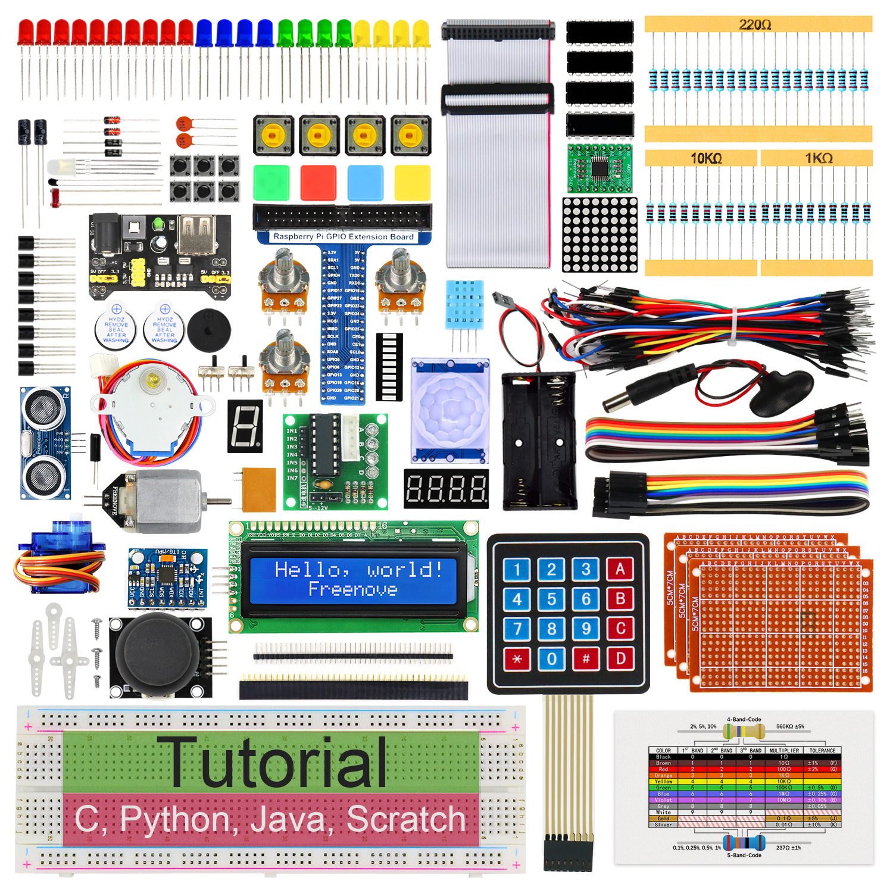
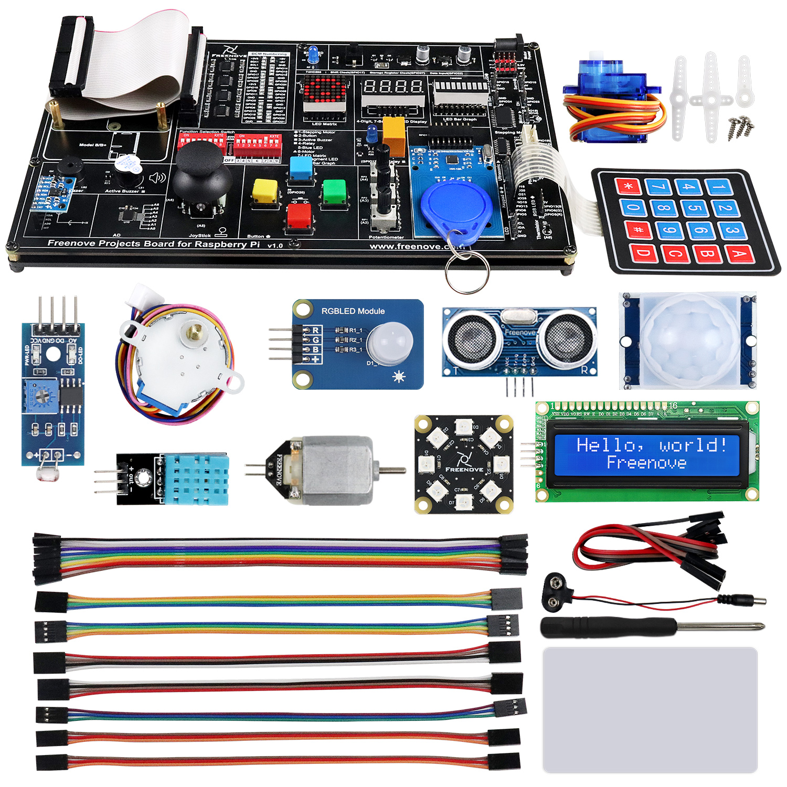
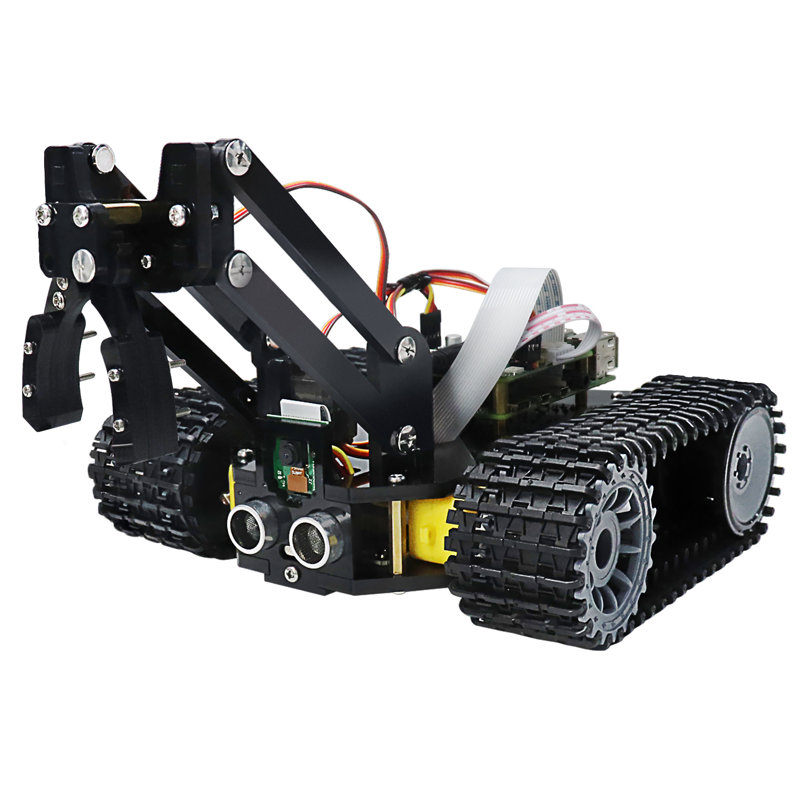

Starter kits
----------------------------------------------------------------

.. list-table:: 
   :header-rows: 1 
   :width: 70%
   :align: center
   :widths: 6 3 12
   
   * -  Image
     -  SKU
     -  Name

   * -  .. centered:: |FNK0019.MAIN|
     -  .. centered:: :Freenove:`fnk0019 <fnk0019>`
     -  **Freenove Super Starter Kit for Raspberry Pi**

   * -  .. centered:: |FNK0020.MAIN|
     -  .. centered:: :Freenove:`fnk0020 <fnk0020>`
     -  **Freenove Ultimate Starter Kit for Raspberry Pi**

   * -  .. centered:: |FNK0022.MAIN|
     -  .. centered:: :Freenove:`fnk0022 <fnk0022>`
     -  **Freenove Basic Starter Kit for Raspberry Pi**

   * -  .. centered:: |FNK0023.MAIN|
     -  .. centered:: :Freenove:`fnk0023 <fnk0023>`
     -  **Freenove LCD1602 Starter Kit for Raspberry Pi**

   * -  .. centered:: |FNK0024.MAIN|
     -  .. centered:: :Freenove:`fnk0024 <fnk0024>`  
     -  **Freenove Ultrasonic Starter Kit for Raspberry Pi**

   * -  .. centered:: |FNK0025.MAIN|
     -  .. centered:: :Freenove:`fnk0025 <fnk0025>` 
     -  **Freenove RFID Starter Kit for Raspberry Pi**

   * -  .. centered:: |FNK0066.MAIN|
     -  .. centered:: :Freenove:`fnk0066 <fnk0066>`
     -  **Freenove Complete Starter Kit for Raspberry Pi**
  
   * -  .. centered:: |FNK0054.MAIN|
     -  .. centered:: :Freenove:`fnk0054 <fnk0054>`
     -  **Freenove Projects Kit for Raspberry Pi**

.. |FNK0019.MAIN| image:: ../_static/products/RaspberryPi/FNK0019.MAIN.jpg    

.. |FNK0022.MAIN| image:: ../_static/products/RaspberryPi/FNK0022.MAIN.jpg   
.. |FNK0023.MAIN| image:: ../_static/products/RaspberryPi/FNK0023.MAIN.jpg    
.. |FNK0024.MAIN| image:: ../_static/products/RaspberryPi/FNK0024.MAIN.jpg    
.. |FNK0025.MAIN| image:: ../_static/products/RaspberryPi/FNK0025.MAIN.jpg    
.. |FNK0066.MAIN| image:: ../_static/products/RaspberryPi/FNK0066.MAIN.jpg    

Robotics kits
----------------------------------------------------------------

.. list-table:: 
   :header-rows: 1 
   :width: 70%
   :align: center
   :widths: 6 3 12
   
   * -  Image
     -  SKU
     -  Name

   * -  .. centered:: |FNK0021.MAIN|
     -  .. centered:: :Freenove:`fnk0021 <fnk0021>`
     -  **Freenove Three-wheeled Smart Car Kit for Raspberry Pi**

   * -  .. centered:: |FNK0036.MAIN|
     -  .. centered:: :Freenove:`fnk0036 <fnk0036>`
     -  **Freenove Robot Arm Kit for Raspberry Pi**

   * -  .. centered:: |FNK0043.MAIN|
     -  .. centered:: :Freenove:`fnk0043 <fnk0043>`
     -  **Freenove 4WD Smart Car Kit for Raspberry Pi**

   * -  .. centered:: |FNK0043B.MAIN|
     -  .. centered:: :Freenove:`fnk0043 <fnk0043>`
     -  **Freenove 4MWD Smart Car Kit for Raspberry Pi**

   * -  .. centered:: |FNK0050.MAIN|
     -  .. centered:: :Freenove:`FNK0050 <fnk0050>`
     -  **Freenove Robot Dog Kit for Raspberry Pi**

   * -  .. centered:: |FNK0052.MAIN|
     -  .. centered:: :Freenove:`FNK0052 <fnk0052>`  
     -  **Freenove Big Hexapod Robot Kit for Raspberry Pi**

   * -  .. centered:: |FNK0077.MAIN|
     -  .. centered:: :Freenove:`fnk0077 <fnk0077>`
     -  **Freenove Tank Robot Kit for Raspberry Pi**

   * -  .. centered:: |FNK0100.MAIN|
     -  .. centered:: :Freenove:`fnk0100 <fnk0100>`
     -  **Freenove Computer Case Kit for Raspberry Pi 5**

.. |FNK0021.MAIN| image:: ../_static/products/RaspberryPi/FNK0021.MAIN.jpg
.. |FNK0036.MAIN| image:: ../_static/products/RaspberryPi/FNK0036.MAIN.jpg
.. |FNK0043.MAIN| image:: ../_static/products/RaspberryPi/FNK0043.MAIN.jpg
.. |FNK0043B.MAIN| image:: ../_static/products/RaspberryPi/FNK0043B.MAIN.jpg
.. |FNK0050.MAIN| image:: ../_static/products/RaspberryPi/FNK0050.MAIN.jpg

.. |FNK0100.MAIN| image:: ../_static/products/RaspberryPi/FNK0100.png